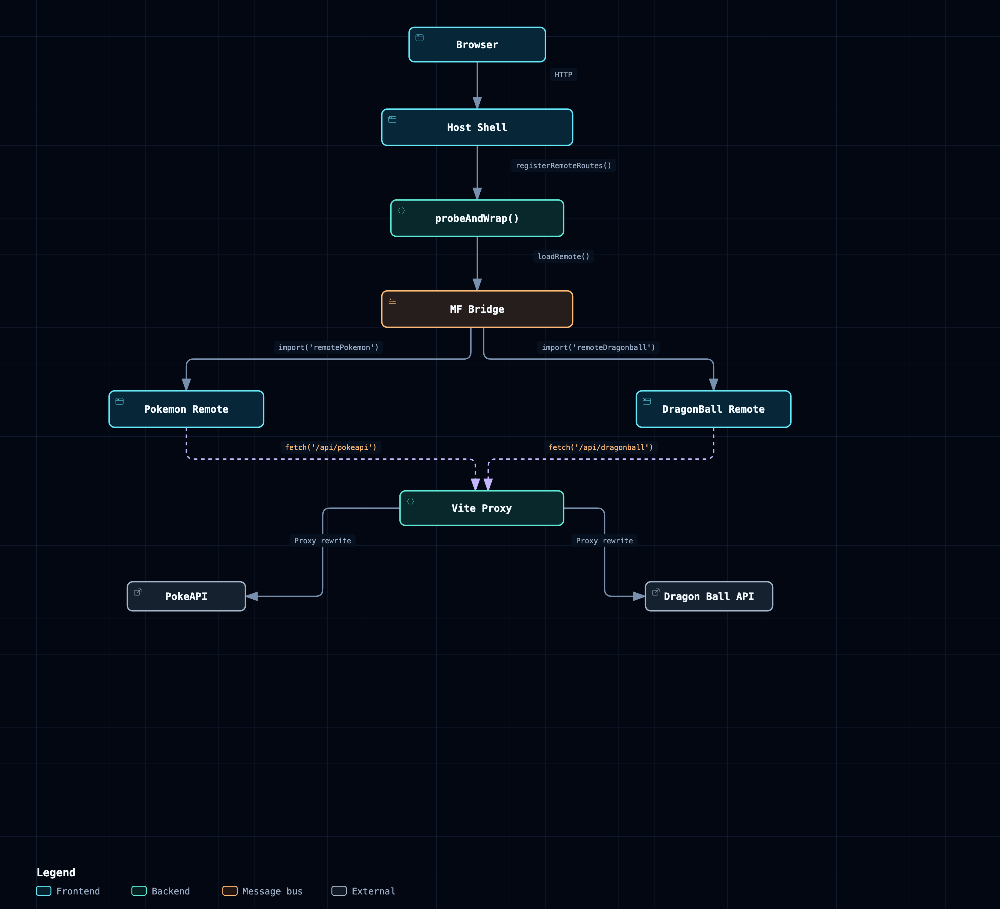

# Microfrontends con Module Federation

Monorepo con tres SPAs independientes. El **host** es el shell (layout + router) y cada
**remote** trae su propio dominio con listado paginado y detalle. Cada app es su propio
hexágono: no se importan código entre sí, solo hablan por el contrato federado.

> Este repositorio es la POC y la base técnica del microfrontend de **PeopleFirst**.
> La decisión de monorepo, el plan de implementación por fases y el registro de riesgos
> están en **[`docs/`](docs/README.md)**. Este README cubre cómo funciona y cómo correrlo.

```
pokedex-vue/
├── package.json               ← workspaces + orquestación (NO es un proyecto)
├── turbo.json                 ← grafo de tareas y cache
├── lint-staged.config.js
├── docs/                      ← plan, riesgos y ADRs  ← empezar por docs/README.md
├── packages/
│   └── mf-shared/             ← contrato `shared` de MF (solo build-time)
└── apps/
    ├── host/                  ← shell: layout, router, plugins   → :5173
    ├── remote-pokemon/        ← hexágono pokemon (PokeAPI)       → :5174
    └── remote-dragonball/     ← hexágono character (DB API)      → :5175
```

| App                 | Dominio     | API                                                             | Rutas                              |
| ------------------- | ----------- | --------------------------------------------------------------- | ---------------------------------- |
| `remote-pokemon`    | `pokemon`   | [PokeAPI](https://pokeapi.co)                                   | `/pokemons`, `/pokemons/:name`     |
| `remote-dragonball` | `character` | [Dragon Ball API](https://web.dragonball-api.com/documentation) | `/dragon-ball`, `/dragon-ball/:id` |

Stack por app: Vue 3 + Vue Router + Pinia + `@pinia/colada` + Awilix + Axios + Tailwind +
Vitest, con arquitectura hexagonal y vertical slicing según la skill
`hexagonal-architecture`. Federación con
[`@module-federation/vite`](https://module-federation.io/integrations/build-tool/vite.html).

Requiere **pnpm 10+** (`corepack enable` lo instala en la versión que fija
`packageManager`) y Node en el rango **22 a 24** (`>=22.0.0 <25.0.0`). El CI corre
sobre Node 24.

```bash
pnpm install          # una sola vez, en la raíz
pnpm dev              # ← levanta las 3 apps en paralelo (host + los dos remotes)
pnpm test             # 65 unit tests: hexágono de cada remote + shell del host + contrato MF
pnpm test:e2e         # 12 e2e (Playwright) contra dev servers — rápido
pnpm test:e2e:preview # los mismos 12 contra los BUILDS ← lo que corre CI
pnpm lint             # incluye eslint-plugin-boundaries en cada app (NO arregla)
pnpm type-check       # vue-tsc por app
pnpm build            # las 3 apps, respetando el grafo de tareas
pnpm preview          # sirve los 3 builds de producción en los mismos puertos
```

Todo eso lo orquesta **Turborepo** (`turbo.json`), que pone el grafo de tareas explícito y
cachea por hash de inputs: un cambio en `remote-dragonball` no vuelve a correr los tests ni
el type-check de `remote-pokemon`. Los scripts siguen llamándose igual, así que quien no
quiera saber de turbo no necesita saberlo.

```bash
pnpm affected        # solo lo tocado respecto de la base — antes de abrir el PR
pnpm graph           # el grafo de build, en imagen
pnpm exec turbo run test:e2e:preview --dry-run=text   # el grafo, en texto
pnpm exec turbo run build --force                     # ignorar el cache (escotilla)
```

Para compilar una sola app (útil cuando solo tocaste un remote y querés saltar las otras dos):

```bash
pnpm --filter remote-pokemon build    # solo remote-pokemon, respeta el cache de turbo
pnpm --filter remote-dragonball build # solo remote-dragonball
pnpm --filter host build              # solo el host
```

Turborepo resuelve el subgrafo desde la raíz, así que el symlink de `@pokedex/mf-shared`
se encuentra sin pasos extra. Output en `apps/<app>/dist/`. Si necesitás forzar la
recompilación ignorando el cache, agregá `--force`:
`pnpm exec turbo run build --filter=remote-pokemon --force`.

`turbo run dev` etiqueta la salida por app, así se sabe de quién es cada línea:

```
host:dev:               ➜  Local:   http://localhost:5173/
remote-pokemon:dev:     ➜  Local:   http://localhost:5174/
remote-dragonball:dev:  ➜  Local:   http://localhost:5175/
```

`lint` **no** lleva `--fix`: una tarea cacheada no debe mutar el fuente. Para arreglar,
`pnpm --filter <app> lint:fix` — que es lo que corre el pre-commit vía `lint-staged`.

Para trabajar en un solo remote sin levantar el resto:
`pnpm dev:remote-dragonball` (corre standalone, con su propio router y layout).
Los puertos son fijos (`strictPort`) porque el host tiene horneada la URL del
`mf-manifest.json` de cada remote: si un remote se moviera de puerto en silencio, la
federación fallaría de forma confusa. Si algo más ocupa el 5173/5174/5175, el arranque
falla a propósito.

Abre http://localhost:5173 → redirige a `/pokemons`. La barra del host lleva a los dos
remotes, cada uno renderizado dentro del mismo layout.

---

## El contrato federado

Cada remote expone **una sola cosa**: una App envuelta con
`createBridgeComponent` (`@module-federation/bridge-vue3`), y el host la carga
a través de `mf-manifest.json` con `@module-federation/runtime`. Decisión y
alternativas en [ADR 0005](docs/adr/0005-bridge-y-manifest-como-contrato.md).

```ts
// apps/remote-pokemon/module-federation.config.ts
exposes: { './export-app': './src/export-app.ts' }

// apps/remote-dragonball/module-federation.config.ts
exposes: { './export-app': './src/export-app.ts' }
```

```ts
// apps/remote-pokemon/src/export-app.ts (el "puente" que el host carga)
import { createBridgeComponent } from '@module-federation/bridge-vue3'
import { createPinia } from 'pinia'
import { PiniaColada } from '@pinia/colada'
import { createRouter, createWebHistory } from 'vue-router'

import App from './App.vue'
import { pokemonRoutes } from './modules/pokemon/presentation/routes/pokemon.routes'
import { coladaOptions } from './base/config/colada/colada.options'

// Strip basename prefix so bridge router doesn't double-prefix
function routesRelativeTo(basename: string | undefined) {
  if (!basename) return pokemonRoutes
  const prefix = basename.replace(/\/+$/, '')
  return pokemonRoutes.map((route) => ({
    ...route,
    path: route.path.startsWith(prefix + '/')
      ? route.path.slice(prefix.length)
      : route.path === prefix
        ? '/'
        : route.path,
  }))
}

export default createBridgeComponent({
  rootComponent: App,
  appOptions: ({ app, basename }) => {
    app.use(createPinia())
    app.use(PiniaColada, coladaOptions)
    const router = createRouter({
      history: createWebHistory(basename ?? import.meta.env.BASE_URL),
      routes: [{ path: '/', redirect: { name: 'pokemon-list' } }, ...routesRelativeTo(basename)],
    })
    return { router }
  },
})
```

El host mantiene su **catálogo** (`apps/host/src/base/config/router/remotes.ts`)
con los datos de cada remote (id, `routeName` de la sección, `navLabel`,
`basePath`) y un `loadApp()` que usa `probeAndWrap` para cargar eagerly el
contrato federado y envolverlo con `createRemoteAppComponent`. Si el remote
no responde, `allSettled` detecta la falla y registra la ruta degradada:

```ts
// apps/host/src/base/config/router/remotes.ts
async function probeAndWrap(loader: () => Promise<unknown>): Promise<Component> {
  await loader() // eagerly probe — allSettled detecta la falla
  return createRemoteAppComponent({
    loader: loader as () => Promise<{ default: unknown }>,
  })
}

const loadPokemonBridge = () => import('remotePokemon/export-app')

export const REMOTES: readonly RemoteDefinition[] = [
  {
    id: 'remotePokemon',
    routeName: 'remote-pokemon',
    navLabel: 'Pokédex',
    basePath: '/pokemons',
    loadApp: () => probeAndWrap(loadPokemonBridge),
  },
  // ...
]
```

Las rutas se registran dinámicamente en `registerRemoteRoutes()`:

```ts
// apps/host/src/base/config/router/index.ts
routes: [
  {
    path: '/',
    component: () => import('@/modules/shared/presentation/layouts/public/PublicLayout.vue'),
    children: [], // filled by registerRemoteRoutes()
  },
]
```

La navegación interna de cada sección (lista, detalle, etc.) la maneja **el router
interno del remote**: el host solo conoce el `basename`. Los nombres de ruta
`pokemon-list` / `pokemon-detail` y `character-list` / `character-detail` ya no son
parte del contrato — viven dentro del bridge.

**Lo que NO cruza la frontera:** las entidades (`Pokemon`, `Character`), los casos de uso,
los ports, los adapters HTTP, los contenedores de Awilix, los mappers, los presentation
models. Todo eso vive y muere dentro de su propia app. Es la regla "cada proyecto es su
propio hexágono" de la skill, aplicada un nivel más arriba: el expose es a un microfrontend
lo que una API REST es a un microservicio.

### El `navLabel` vive en el host, no en el remote

El catálogo del host es la **fuente de verdad** del label de la sección. Los remotes
ya no declaran `meta: { navLabel: '…' }` en sus rutas — el host lo pone en la ruta
catch-all (`meta: { navLabel: 'Pokédex' }`). Razón: el label es un problema de UX
(idioma, orden, copy) que depende del shell, no del remote.

```ts
// apps/host/src/base/config/router/remotes.ts — fuente de verdad
{
  id: 'remotePokemon',
  routeName: 'remote-pokemon',
  navLabel: 'Pokédex',
  basePath: '/pokemons',
  loadApp: () => probeAndWrap(loadPokemonBridge),
}
```

**El estado seleccionado se calcula por prefijo de URL, no con `active-class`.** El
catch-all de cada sección consume todo lo que caiga bajo `/pokemons/*` o
`/dragon-ball/*`, así que la pestaña sigue encendida mientras hay un detalle abierto.
El ViewModel compara `route.path` contra el path de la sección
(`=== path || startsWith(path + '/')`); la View solo pinta el `isSelected` que recibe
— sigue siendo pasiva. Hay tests que cubren el detalle y el caso borde de dos
secciones con prefijo común (`/alpha` vs `/alpha-beta`).

La superficie de tipos que el host conoce está declarada a mano en
`apps/host/src/types/remotes.d.ts` — un `declare module` por remote, con el tipo
`ReturnType<typeof createBridgeComponent>`. La generación automática de `.d.ts` de
MF está apagada (`dts: false`) porque invoca `tsc` pelado y no sabe compilar `.vue`
ni `.css`; declararlo a mano además obliga a que el contrato se revise en un PR.

### Carga por `mf-manifest.json`, no por `remoteEntry.js`

El host apunta a cada remote por su **manifest** (`mf-manifest.json`), no por su
`remoteEntry.js`:

```ts
// apps/host/module-federation.config.ts
remotes: {
  remotePokemon: 'remotePokemon@http://localhost:5174/mf-manifest.json',
  remoteDragonball: 'remoteDragonball@http://localhost:5175/mf-manifest.json',
}
```

El runtime (`@module-federation/runtime`) descarga el manifest primero, ve qué
módulos expone cada remote, y solo entonces trae los chunks del módulo
que se va a renderizar (`./export-app`). Resultado: una request de descubrimiento
antes de pagar por la inicialización del remote, y la posibilidad de invalidar
solo el manifest en vez del bundle entero al cambiar un expose.

Las URLs se leen de `apps/host/.env`:

```bash
VITE_REMOTE_POKEMON_MANIFEST_URL=http://localhost:5174/mf-manifest.json
VITE_REMOTE_DRAGONBALL_MANIFEST_URL=http://localhost:5175/mf-manifest.json
```

Y están declaradas en `turbo.json → tasks.build.env` para que turbo no cachee
un build con la URL del manifest equivocada.

### API Proxies

Cuando los remotes corren dentro del host (federado), sus llamadas a API
hittean el origen del host, no el suyo propio. El host provee proxies en
`vite.config.ts` para reescribir las URLs:

```ts
// apps/host/vite.config.ts
server: {
  proxy: {
    '/api/pokeapi': {
      target: 'https://pokeapi.co',
      changeOrigin: true,
      rewrite: (path) => path.replace(/^\/api\/pokeapi/, '/api/v2'),
    },
    '/api/dragonball': {
      target: 'https://dragonball-api.com',
      changeOrigin: true,
      rewrite: (path) => path.replace(/^\/api\/dragonball/, '/api'),
    },
  },
},
```

Cada remote también tiene su propio proxy para modo standalone
(`apps/remote-*/vite.config.ts`), pero en modo federado solo el proxy del
host está activo.

### Qué debe cumplir el host (la otra mitad del contrato)

Los remotes no son autosuficientes en tiempo de ejecución federado. Dan por hecho que el
host:

1. **Comparte los mismos singletons.** `vue`, `vue-router`, `pinia` y `@pinia/colada`
   están declarados `singleton: true` en ambos lados. Dos copias de Vue = dos sistemas de
   reactividad; dos routers = las pantallas del remote nunca ven la navegación del host.
   La declaración vive en **un solo sitio** (`packages/mf-shared`) y las tres configs la
   importan: tres copias a mano podían divergir sin que fallara nada hasta producción.
2. **Pasa el `basename` al bridge.** Cada remote recibe su sección como `basename` para
   que su router interno construya URLs relativas correctas. Sin esto, los `<RouterLink>`
   internos del remote apuntarían a la raíz y romperían la navegación de la sección.
3. **No comparte estado con el remote en runtime.** El bridge crea una Vue app propia
   por mount: cada remote tiene su **propio** Pinia, su **propio** Pinia-Colada cache y
   su **propio** contenedor de Awilix. El host no lee estado del remote ni el remote
   del host — esa es la autonomía que justifica el contrato bridge.

### Un remote caído no tumba el shell

Los contratos se cargan con `probeAndWrap` (eagerly probe) y `Promise.allSettled`
en `registerRemoteRoutes()` (`src/base/config/router/`). Si el remote no
responde, se registra una ruta degradada con `RemoteUnavailableScreen` que
muestra "Pokédex is unavailable" o "Dragon Ball is unavailable". El remote
queda en la barra de navegación y su ruta base explica qué pasó, mientras el
resto de la aplicación funciona con normalidad.

```ts
// Degraded mode en registerRemoteRoutes()
router.addRoute(SHELL_ROUTE_NAME, {
  path: remote.basePath,
  name: `${remote.id}-unavailable`,
  component: () => import('@/modules/shared/presentation/screens/RemoteUnavailableScreen.vue'),
  props: { sectionLabel: remote.navLabel },
  meta: { navLabel: remote.navLabel },
})
```

Con los imports estáticos anteriores, un remote caído dejaba el `#app` en 0 bytes: sin
navbar, y el otro remote inaccesible aunque estuviera sano. Está cubierto en
`e2e/remote-outage.spec.ts`, que aborta el tráfico al origen de un remote.

### Estilos

Tailwind genera el CSS escaneando las fuentes de **cada** app, así que el host no conoce
las clases que usan las pantallas del remote. Por eso el módulo expuesto importa su propio
stylesheet:

```ts
// apps/remote-*/src/export-app.ts (y main.ts en standalone)
import '@/assets/main.css'
```

Así los estilos viajan con el contrato (`assets/pokemon-*.css` y `assets/character-*.css`,
~12 kB cada uno) y funcionan igual en modo federado que standalone. El coste es que el
preflight de Tailwind se inyecta una vez por app: 3.616 B (~1.306 B gzip) ×3 en la misma
página. Hoy las tres capas `base` son byte a byte idénticas, así que es desperdicio y no un
bug visual — deuda aceptada y documentada en
[ADR 0001](docs/adr/0001-module-federation-en-monorepo.md).

### El remote corre solo

`pnpm --filter remote-pokemon dev` (:5174) y
`pnpm --filter remote-dragonball dev` (:5175) levantan cada remote con su propio
`main.ts`, `App.vue` y router standalone. Por eso los `shared` **no** llevan
`import: false`: conservar el fallback local es lo que permite desarrollarlos y depurarlos
sin host.

---

## Verificación

Dos niveles, y la diferencia importa:

- **Unit (Vitest)** — cada remote prueba su hexágono; el host se prueba contra **stubs** de
  los contratos federados (`apps/host/tests/stubs/`). Rápido, sin red, sin remotes.
- **Contrato MF (`packages/mf-shared/tests/`)** — verifica que el rango `requiredVersion`
  declarado siga siendo un superconjunto de lo que cada app instala. Sin esto, subir una
  app a Vue 4 dejaría `^3.5.0` mintiendo, con el build en verde y dos Vues en producción.
- **E2E (Playwright, `apps/host/e2e/`)** — el único sitio donde el host real carga los
  remotes reales por Module Federation en un navegador. Es lo que prueba que la composición
  funciona de verdad: singletons compartidos, chunks remotos, CSS federado y datos en vivo.

### `dev` vs `preview`: la diferencia que importa

El e2e corre en dos modos y **solo uno reproduce producción**:

```bash
pnpm test:e2e            # E2E_MODE=dev: los 3 dev servers. Rápido, para iterar.
pnpm test:e2e:preview    # build + los 3 dist/ servidos. Lo que corre CI.
```

En dev cada app sirve módulos sin minificar ni chunkear, así que el contrato `shared` no se
ejercita y el minificador nunca entra. Contra builds, cada app lleva su copia de fallback y
el runtime tiene que negociar de verdad. Además, el **grafo de chunks federados depende del
gestor de paquetes** — ver [ADR 0003](docs/adr/0003-pnpm.md) — así que este es el único
sitio donde se verifica el artefacto que se despliega.

No es teórico: el primer `test:e2e:preview` tumbó 5 de 7 tests que pasaban en dev, por un
`InjectionMode.CLASSIC` de Awilix que resuelve por nombre de parámetro del constructor —
nombre que el minificador renombra a `e`. Llevaba ahí desde el primer commit.

Lo que cubre el e2e: la barra lista ambos remotes, cada remote renderiza dentro del layout
del host, hacer clic cambia de sección, **la selección sobrevive al entrar a un detalle**
(la regresión que motivó todo esto), los estilos del remote viajan con su contrato, no hay
errores de consola, ambos remotes traen datos reales de sus APIs, y —con el tráfico a un
remote cortado— el shell arranca igual y el remote sano sigue funcionando.

```bash
npx playwright test --ui --config apps/host/playwright.config.ts   # modo interactivo
```

CI (`.github/workflows/ci.yml`) corre dos jobs: `checks` (lint + tipos + unit) y `e2e`
contra builds, con el reporte de Playwright subido como artifact. Los dos restauran el cache
de Turborepo (`.turbo`) por rama, con fallback a `main`, así que una rama nueva no arranca en
frío. El job `e2e` no construye a mano: la tarea declara que depende de los tres builds y
turbo devuelve desde cache lo que no cambió.

---

## Despliegue

Las tres apps compilan a `dist/` independientes; el monorepo es conveniencia de desarrollo.
Dicho eso, hay dos puntos donde el despliegue **sí** sigue acoplado (URL de los remotes
horneada en el build del host, y lockfile único), detallados en
[ADR 0001](docs/adr/0001-module-federation-en-monorepo.md) junto con las condiciones bajo
las que Module Federation compensa aquí.

### Remote → bucket de GCP

```bash
VITE_PUBLIC_PATH=https://cdn.midominio.com/remote-pokemon/ \
  pnpm exec turbo run build --filter=remote-pokemon
gsutil -m rsync -r apps/remote-pokemon/dist gs://mi-bucket/remote-pokemon

VITE_PUBLIC_PATH=https://cdn.midominio.com/remote-dragonball/ \
  pnpm exec turbo run build --filter=remote-dragonball
gsutil -m rsync -r apps/remote-dragonball/dist gs://mi-bucket/remote-dragonball
```

Cada remote se despliega por separado: publicar Dragon Ball no obliga a tocar Pokémon.

Tres cosas que hay que hacer bien:

- **`VITE_PUBLIC_PATH` es obligatorio en producción.** El host carga estos chunks desde
  otro origen; con rutas relativas el navegador las resolvería contra el origen del host y
  daría 404. Ese valor se convierte en el `base` de Vite.
- **CORS en el bucket.** El host hace `import()` de `mf-manifest.json` y de los
  chunks cross-origin, así que el bucket tiene que responder con
  `Access-Control-Allow-Origin` para el dominio del host.
- **Cache headers.** `mf-manifest.json` con TTL corto o `no-cache`; los chunks con
  hash, `immutable, max-age=31536000`. Si cacheas el manifest de forma agresiva,
  despliegas una versión nueva del remote y el host sigue viendo la vieja.
- **`VITE_PUBLIC_PATH` tiene que estar declarada en `turbo.json → tasks.build.env`** (ya lo
  está). Si no, turbo consideraría idénticos dos builds con URLs de CDN distintas y
  devolvería el cacheado: un remote pidiendo sus chunks al bucket equivocado, 404 en runtime
  y CI en verde. Cada variable nueva que entre a un bundle se agrega a esa lista.

### Host → Cloud Storage + CDN

El host se sirve desde un bucket de Cloud Storage con CDN, igual que los remotes:

```bash
VITE_PUBLIC_PATH=https://cdn.midominio.com/host/ \
  pnpm exec turbo run build --filter=host
gsutil -m rsync -r apps/host/dist gs://mi-bucket/host
```

El build del host requiere el lockfile de la raíz y el subgrafo del workspace. Con pnpm el
subgrafo es expresable:

```dockerfile
COPY package.json pnpm-lock.yaml pnpm-workspace.yaml ./
COPY apps/host/package.json apps/host/
COPY packages/mf-shared/package.json packages/mf-shared/
RUN corepack enable && pnpm install --frozen-lockfile --filter host...
COPY apps/host apps/host
COPY packages/mf-shared packages/mf-shared
RUN pnpm --filter host build
# → gsutil rsync a Cloud Storage
```

El `--filter host...` (con los tres puntos) instala el host **y sus dependencias de
workspace**, no el árbol completo.

`VITE_REMOTE_POKEMON_MANIFEST_URL` y `VITE_REMOTE_DRAGONBALL_MANIFEST_URL` se resuelven en
el build del host, así que cambiar la URL de un remote implica rebuild del host. Si quieres
desplegarlos de forma totalmente independiente, el siguiente paso es resolver esa URL en
runtime con `registerRemotes()` (`@module-federation/runtime`) en el `main.ts` del host —
un `window.__MF_REMOTES__` inyectado por el servidor o el runtime API de MF.

---

## El contrato "Colada confinado" (se mantiene)

`@pinia/colada` sigue viviendo **solo** dentro de los `use*ViewModel.ts` del remote. La
View, el dominio, la aplicación y la infraestructura no saben que existe.

1. **Solo los ViewModels importan la librería** (más `main.ts` / `base/config/colada` para
   registrar el plugin, que en modo federado hace el host, y el helper de tests).
   Verificable:
   ```bash
   grep -rl "@pinia/colada" apps/*/src/
   ```
   Las keys llevan el módulo por delante (`['pokemon', …]`, `['character', …]`), así que
   dos remotes comparten la caché del host sin pisarse.
2. **La `query` del VM es el único lugar del frontend que lanza.** Los use cases retornan
   `Result<T>` y nunca lanzan; el VM desenvuelve con
   `if (result.isErr()) throw result.getError()`. Es la frontera driving — simétrico al
   controller del backend, que lanza hacia su `DomainExceptionFilter`. Aquí el "filter" es
   el motor de queries, que captura y expone `error`.
3. **La caché guarda datos de dominio** (`Paginated<PokemonSummary>`, `Pokemon`), no models
   de presentación. El VM mapea con `computed` + Screen Mapper.
4. **La View recibe `string | null` como error** — el VM mapea `DomainException.code` →
   mensaje vía `toUiError`. Jamás expone la excepción, el `Result` ni el objeto query.
5. **Keys**: `[modulo, accion, ...params]` → `['pokemon', 'list', page]`.
6. **Política técnica centralizada**: `staleTime` en `base/config/colada/colada.options.ts`.
   En modo federado **ganan las opciones del host**, que es quien instala el plugin.
   ***

## Estructura

```
packages/mf-shared/
└── src/index.ts                  ← `sharedSingletons`: única definición del contrato

apps/host/
├── module-federation.config.ts   ← remotes (importa los singletons de mf-shared)
├── src/
│   ├── main.ts                   ← única app: pinia + colada + registro de remotes
│   ├── types/remotes.d.ts        ← contrato tipado de los remotes
│   ├── base/config/router/
│   │   ├── remotes.ts            ← catálogo: loaders dinámicos + fallback por remote
│   │   └── index.ts              ← createShellRouter + registerRemoteRoutes
│   ├── base/config/{env,colada}/
│   └── modules/shared/presentation/
│       ├── models/nav-item.model.ts
│       ├── screens/              ← RemoteUnavailableScreen, NotFoundScreen
│       └── layouts/public/       ← PublicLayout.vue + usePublicLayoutViewModel.ts
├── e2e/                          ← navbar.spec.ts + remote-outage.spec.ts
└── tests/
    ├── stubs/                    ← dobles de cada contrato federado
    ├── base/config/router/       ← composición shell + remotes, y modo degradado
    └── modules/shared/…          ← verifica la navegación derivada

apps/remote-<dominio>/
├── module-federation.config.ts   ← exposes: { './export-app': ... }
├── src/
│   ├── main.ts, App.vue          ← solo para correr standalone
│   ├── export-app.ts             ← entry federado: createBridgeComponent(...) que envuelve la App + router
│   ├── base/                     ← Result, bases, http, env, di, colada
│   └── modules/<dominio>/
│       ├── domain/               ← entidades, VO, excepciones, props, port
│       ├── application/          ← <X>sFinder, <X>Finder
│       ├── infrastructure/       ← DTOs de la API, mapper, Http<X>Repository
│       └── presentation/         ← screens (View + VM), mappers, models, routes
└── tests/                        ← espeja src; builders + helpers/with-setup
```

La duplicación de `src/base/` entre las tres apps es **deliberada** (regla de la skill): es
el precio de que cada una sea autónoma y desplegable por separado. Extraer un paquete
compartido acoplaría los despliegues y es una decisión explícita, no automática.


